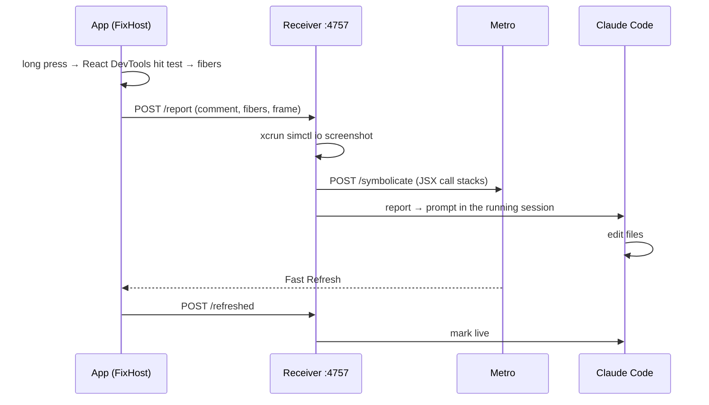

# react-native-press-to-fix

> Point at a bug in your React Native app. Claude Code (or Codex) fixes it while you watch.

[](https://www.npmjs.com/package/react-native-press-to-fix)


<p align="center">
  
  <br><sub>A real session, sped up 1.5×: four bugs fixed in about a minute. <a href="https://github.com/ezescigo/react-native-press-to-fix/raw/main/docs/demo.mp4">MP4</a></sub>
</p>

You're clicking through your app and spot something off: a price missing its cents, a button that looks disabled. Normally you'd hunt for the component, find the style and describe it to your agent. With press-to-fix you **hold your finger on it for half a second** and type one sentence. The report goes straight into the Claude Code session running in your project, with the exact file and line already filled in. Fast Refresh shows you the fix a few seconds later.

## Setup

Three steps, about two minutes.

**1. Give Claude Code the plugin**

```bash
claude plugin marketplace add ezescigo/react-native-press-to-fix
claude plugin install press-to-fix@press-to-fix
```

**2. Add the package to your app**

```bash
npx expo install react-native-press-to-fix     # Expo
npm install --save-dev react-native-press-to-fix   # bare React Native
```

**3. Wrap your root component**

```tsx
import { FixHost } from 'react-native-press-to-fix'

export default function App() {
  return <FixHost>{/* your app */}</FixHost>
}
```

Then run the app in the iOS simulator, start `claude` in the project folder, and long press anything.

> Add `.fixmod/` to `.gitignore`, since screenshots and statuses are written there. To let Claude open screenshots without asking, add `"Read(./.fixmod/**)"` to `permissions.allow` in `.claude/settings.json`.

**Requirements:** Claude Code 2.1.287+ · Node 18.2+ · Xcode with an iOS simulator · React Native 0.76+ (React 18 or 19)

## Using Codex (beta)

The same plugin works with the [Codex CLI](https://github.com/openai/codex). Install it from this repo:

```bash
codex plugin marketplace add ezescigo/react-native-press-to-fix
codex plugin add press-to-fix@press-to-fix
```

Steps 2 and 3 above stay the same. Start `codex` in the project, and each long press becomes a turn in that session with the screenshot attached. Ask Codex to *show the press-to-fix queue* for statuses; the pill in the app works as it does with Claude.

Codex reports reach the session through Codex's shared app-server, the background server that `codex` attaches to by default. Two things make Codex run a session on its own private server, where reports can't reach it:

- starting `codex` with `-c` or `--enable` overrides
- a Codex CLI on a different version from the shared server (`codex app-server daemon version` shows both)

The queue tool says so when this happens. With several Codex sessions in one folder, reports go to the most recent one.

## What Claude receives

Your sentence, plus a single context line:

```
Prices should show cents

[fix r1] /app/src/components/DrinkRow.tsx:15 · Text "$4.5" in <DrinkRow> in <MenuScreen> · /app/.fixmod/reports/r1.png
```

| Part | Where it comes from |
| --- | --- |
| `DrinkRow.tsx:15` | The line in **your** code where the pressed element's JSX is written. Library internals are skipped: pressing text inside a third-party button points at the line where you used the button. |
| `Text "$4.5"` | The element and what it displays. |
| `<DrinkRow> in <MenuScreen>` | Your components around it, innermost first. |
| `r1.png` | A simulator screenshot with the element outlined in red. |

No setup is needed for any of this. If you want a stable name, wrap a view in `<Fixable name="menu.price">` and the name leads the line. `useFixScreen('Menu')` adds the screen name to reports sent while that component is mounted.

## Following a fix

A pill at the top of the app tracks each request:

| | |
| --- | --- |
| 🟡 `queued` | Claude is busy with an earlier request |
| 🔵 `fixing` | Claude is working on it |
| 🟣 `rebuilding` | A native rebuild is running (`expo run:ios`, `pod install`…) |
| 🟢 `live` | Fast Refresh applied the change, so you're looking at the fix |
| 🔴 `not on screen` | The turn ended without the change reaching the app |

In the terminal, `/fix-queue` opens a pane listing every request with its element, source line and edited files.

## Under the hood



- **No native code.** The package is plain TypeScript, so it runs in Expo Go.
- **It doesn't steal touches.** The long press is detected by observing touch events, so buttons, lists and scroll views keep working. Moving more than 10pt cancels it.
- **Source lines without a Babel plugin.** React 19 records a stack for every JSX element in development. The receiver asks Metro to map those stacks back to your files. On React 18 it reads Babel's `__source` instead.
- **Development only.** In production builds `FixHost` returns its children and nothing else runs.
- **One session owns the port.** Opening a second Claude Code session takes the reports over.

## Troubleshooting

| Symptom | Fix |
| --- | --- |
| Pill says *Claude Code is not listening* | Start `claude` in the project. If it's already running, check `/plugin` shows press-to-fix enabled. |
| Report has no file/line | Metro must be running on the same machine; reports still arrive with the element and screenshot. |
| Port 4757 is taken | Set `FIXMOD_PORT` for Claude Code and pass `url` to `<FixHost url="http://127.0.0.1:PORT">`. |

## Try it: Brewline

`example/` holds Brewline, a small coffee-ordering app with four planted bugs:

```bash
npm install
./scripts/reset-demo.sh                 # restores the bugs, opens Brewline in the simulator
cd example && claude --plugin-dir ../mod
```

| Screen | Press | Say |
| --- | --- | --- |
| Menu | a price like `$4.5` | prices should show cents |
| Menu | the *All* chip | the selected filter should be the dark one |
| Order | *Place order* | button looks disabled |
| Rewards | the progress bar | bar should show 7 of 8 |

## Roadmap

- Codex support out of beta ([plan](CODEX_PLAN.md))
- Android emulator
- Physical devices over LAN

## Contributing

`scripts/test.sh` runs everything: plugin validation, the mod and receiver tests, the package's tests and type checks, and the example's types.

## Credits

Inspired by [FixKit](https://github.com/ostiums/fixkit), which does the same for SwiftUI and UIKit. The Claude Code mod here began as a port of its mod.

MIT © ezescigo
